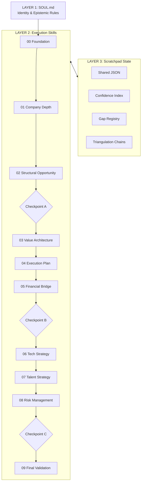

# dilli — Cognitive Architecture for PE Diligence Agents

An agentic CLI for PE-grade company diligence. Takes a company name. Produces a complete investment analysis memo.

The hard problem in building AI for private equity isn't the API plumbing — it's preventing the agent from hallucinating EBITDA, inflating confidence on thin data, defaulting to cost reduction as the only AI lens, and rationalizing a conclusion instead of researching toward one.

This tool was built to solve those failure modes specifically.

---

## The Problem

Standard AI tools applied to PE diligence fail in predictable ways:

- **Generic output** — "AI could help reduce costs" instead of "STP at 45% vs. 65% sector ceiling, $20-35M compression addressable in 36 months"
- **Unvalidated numbers** — revenue stated without sources, EBITDA estimated without derivation chains
- **Single-lens thinking** — cost reduction as the only AI opportunity, missing data monetization, moat-building, revenue expansion
- **Hallucination on thin data** — private companies have limited public data; agents fill gaps with confident-sounding estimates rather than flags of uncertainty
- **No context chain** — each section written in isolation, contradictions between blocks go undetected

---

## The Architecture

The system is built on an interacting three-layer architecture: **Identity**, **Execution**, and **State**.

### The 10 Skills

Each of the 10 sequential skills executes four strict phases: **Plan → Gather → Reason → Validate**. The prompt instructions for these are located in `src/skills/`.

1. **00 Foundation:** Assembles the reference layer (industry benchmarks, pre/post-transformation comps, relevant failure cases). Overrides hallucinated generic logic.
2. **01 Company Depth:** Facts only. Scale, ownership (with hold-period assessment), unit economics. Strict stop-loss rules prevent infinite search loops.
3. **02 Structural Opportunity:** Evaluates all 5 AI opportunity types (Cost, Data, Revenue, Quality, Moat). Ranks by EBITDA magnitude with an adversarial inversion check.
4. **03 Value Architecture:** Translates opportunities into a concrete target operating model (H1/H2). Triangulates required investments.
5. **04 Execution Plan:** Sequences the transformation (waves, gates, required capital phasing, critical dependency chains).
6. **05 Financial Bridge:** The core thesis delta. Entry EBITDA to Exit EBITDA. Requires explicit do-nothing modeling and 2+ method triangulation for all inputs.
7. **06 Tech Strategy:** Assesses current tech debt, dictates build vs. buy vs. integrate decisions, and flags vendor lock-in risks.
8. **07 Talent Strategy:** Maps key leadership hires required *before* specific waves can start. Calculates workforce evolution vs. natural attrition ceilings.
9. **08 Risk Management:** Combative "bear case". Forces compounding failure scenarios (R1 causes R2 causes R3) and builds a quantified exit floor case.
10. **09 Final Validation:** A specialized LLM-as-a-judge reviews the complete scratchpad memory block looking for confidence drift or consistency breaks.

## Deep Dive: Methodology, Evals & Guardrails

The value of this architecture is in the structural constraints placed on the agent to ensure it behaves like a fiduciary researcher. 

Read **[METHODOLOGY.md](./METHODOLOGY.md)** for a deep dive into:
- **The 7 Core Principles** (e.g. *Separate Gathering from Reasoning*, *Honest Degradation*)
- **The Evaluation & Calibration Framework** (Automated vs Human Spot Checks)
- **Hard & Soft Guardrails**
- **The SKILL 00 Reference Layer Structure** (What data must ground the thesis)

---

## Current Status & Roadmap

This repository constitutes **Phase 1: The Cognitive Architecture**. It defines the epistemic rules, state management, and reasoning constraints required for high-stakes diligence, isolated from the execution plumbing.

**Phase 2: The Execution Engine (In Progress)**
- A TypeScript CLI runner to execute the 10-skill pipeline dynamically.
- Integration of the automated evaluation suite (`src/eval/`) for programmatic schema, confidence calibration, evidence integrity, and hallucination testing.
- Hard guardrail implementations (e.g., throwing programmatic errors if `HIGH` confidence claims lack 2+ independent sources in the `scratchpad`).

> [!TIP]
> **Pro Tip for Claude Code Users:**
> This repository uses a conceptual structure (`SOUL.md` and `src/skills/`). To evolve this into an active agent using [Claude Code](https://docs.anthropic.com/en/docs/agents-and-tools/claude-code/overview), it is recommended to reorganize per Anthropic's [Memory and Metadata](https://docs.anthropic.com/en/docs/agents-and-tools/claude-code/memory-and-metadata) guidelines:
> - Rename/Merge `SOUL.md` → `CLAUDE.md` in the project root.
> - Relocate `src/skills/` → `.claude/skills/` to leverage [Claude Skills](https://docs.anthropic.com/en/docs/agents-and-tools/claude-code/enhancing-claude-code/skills) for automated capability discovery.

---

*The standard: a senior partner at a top PE firm reading this output should find nothing they need to verify before using it to inform a preliminary investment decision. Not "good for an AI" Good, full stop.*